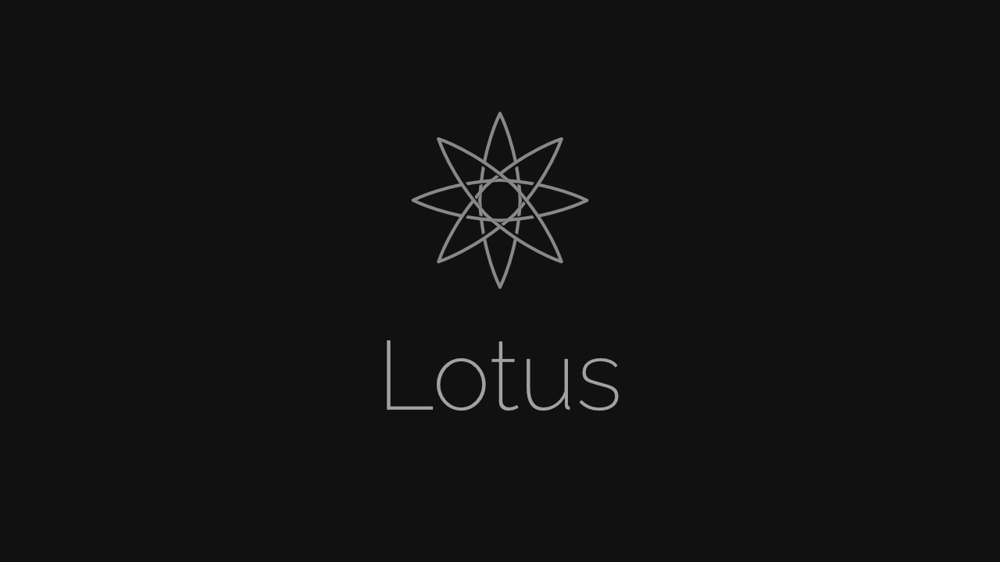
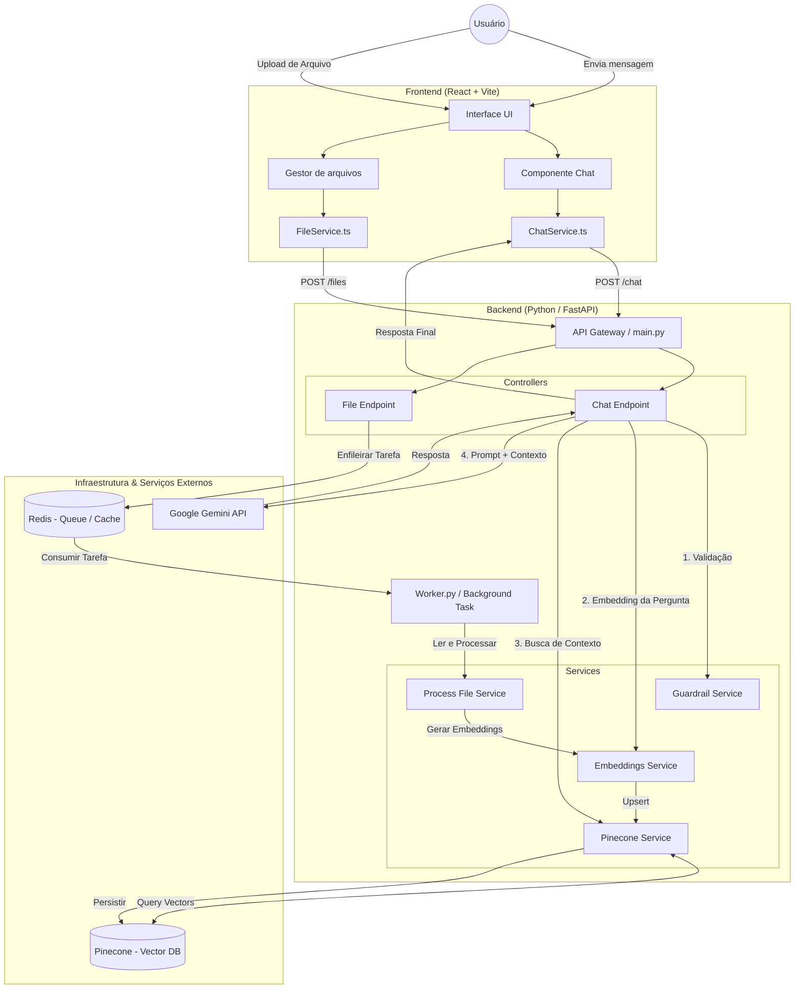

# 🌸 Lotus — Chatbot Inteligente Baseado em RAG

Lotus é uma aplicação de **chatbot inteligente** baseada em **RAG (Retrieval‑Augmented Generation)**. O sistema permite que utilizadores façam upload de documentos, processem o seu conteúdo e conversem com uma Inteligência Artificial que utiliza esses arquivos como **contexto** para responder a perguntas de forma mais precisa e confiável.

---

## 📂 Estrutura do Projeto

```text
Lotus/
├── backend/
│   ├── app/
│   │   ├── api/          # Rotas da API (Chat, Files)
│   │   ├── core/         # Configurações, Logging, Prompts
│   │   ├── domain/       # Modelos de Domínio (DTOs)
│   │   ├── schemas/      # Schemas Pydantic
│   │   ├── services/     # Lógica de Negócio (RAG, Redis, Pinecone)
│   │   └── utils/        # Validadores e Utilitários
│   ├── requirements.txt
│   └── .env
│
└── frontend/
    ├── src/
    │   ├── components/   # Componentes React (Chat, Sidebar, Inputs)
    │   ├── contexts/     # Context API (Chat, Files)
    │   ├── services/     # Integração com API (Fetch)
    │   ├── types/        # Definições TypeScript
    │   └── layout/       # Estrutura de Header / Page
    └── package.json
```
---

## ✨ Funcionalidades Principais

* **Upload de Arquivos**

  * Suporte para múltiplos formatos de arquivos.

* **Processamento RAG (Retrieval‑Augmented Generation)**

  * **Embeddings:** Os arquivos enviados são processados e convertidos em vetores (embeddings) utilizando **Voyage AI (MongoDB)**.
  * **LLM (Large Language Model):** O modelo **`gemini-2.5-flash`** (Google Gemini) recebe o contexto recuperado e gera as respostas.

---

## 🏗️ Arquitetura do Sistema

O fluxo de dados ocorre da seguinte forma:

### 📊 Diagrama de Arquitetura



---

## 🧩 Componentes da Arquitetura

### Backend

* **Framework:** FastAPI (Python 3.12+)
* **Responsabilidades:**

  * Orquestração da lógica de negócio
  * Processamento de arquivos
  * Integração com serviços de embeddings, base vetorial e LLM

### Frontend

* **Framework:** React + Vite
* **Responsabilidades:**

  * Interface de utilizador
  * Upload de arquivos
  * Chat em tempo real com a IA

---

## 🚀 Tecnologias Utilizadas

### Backend (`/backend`)

* **Linguagem:** Python 3.12+
* **Framework Web:** FastAPI
* **IA & LLM:**

  * LangChain (orquestração de cadeias de IA)
  * Google Gemini (`gemini-2.5-flash`)
  * Voyage AI (embeddings)
* **Base de Dados:**

  * Pinecone — base de dados vetorial
  * Redis — cache e histórico de chat
* **Segurança:** Guardrails para validação de input seguro

### Frontend (`/frontend`)

* **Framework:** React 19
* **Build Tool:** Vite
* **Linguagem:** TypeScript
* **Estilização:** Tailwind CSS v4
* **Componentes:**

  * Lucide React (ícones)
  * React Markdown (renderização de texto)

---

## 📦 Instalação e Execução

### 🛠️ Pré-requisitos

Para rodar o projeto localmente, irá precisar de:

* Python 3.12+
* Node.js 20+
* Docker & Docker Compose (opcional, mas recomendado para o Redis)
* Contas e chaves de API para:

  * Google AI Studio (Gemini)
  * Pinecone
  * Voyage AI
  * Redis (local ou cloud)

---

### ▶️ Passos de Instalação

#### 1️⃣ Clonar o Repositório

```bash
git clone https://github.com/Maldak123/Lotus.git
cd Lotus
```

---

#### 2️⃣ Configurar o Backend

```bash
cd backend
```

##### Criar e ativar o ambiente virtual

**Linux / macOS**

```bash
python -m venv venv
source venv/bin/activate
```

**Windows**

```powershell
python -m venv venv
.\venv\Scripts\activate
```

##### Instalar dependências

```bash
pip install -r requirements.txt
```

##### Configurar variáveis de ambiente

Crie um ficheiro `.env` em `backend/`:

```env
# Redis Configuration
REDIS_HOST_NAME=localhost
REDIS_PASSWORD=sua_senha_redis
REDIS_PORT=6379
REDIS_CHAT_URL=redis://:sua_senha_redis@localhost:6379/0

# AI Services Keys
GOOGLE_API_KEY=sua_chave_google_gemini
VOYAGE_API_KEY=sua_chave_voyage
PINECONE_API_KEY=sua_chave_pinecone

# Pinecone Config
PINECONE_HOST_NAME=seu_host_pinecone
PINECONE_INDEX_NAME=nome_do_index
```

##### Iniciar o servidor

```bash
uvicorn main:app --reload
```

* Backend disponível em: **[http://localhost:8000](http://localhost:8000)**
* Documentação da API: **/docs**

#### Iniciar o Worker na raíz do Backend

```bash
python3 worker.py
```

---

#### 3️⃣ Configurar e Iniciar o Frontend

```bash
cd ../frontend
```

##### Instalar dependências

```bash
npm install
# ou yarn install
```

##### Iniciar o servidor de desenvolvimento

```bash
npm run dev
# ou yarn dev
```

---


## 📄 Licença

Este projeto foi feito apenas como forma de estudo, e está licenciado sob a **MIT License**.
