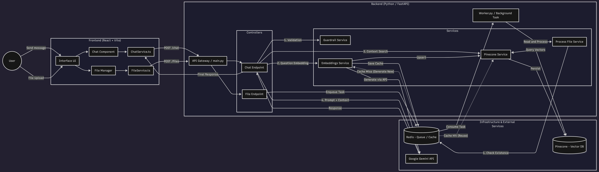

# 🌸 Lotus - Intelligent Chatbot Based on RAG

Lotus is an intelligent chatbot application based on RAG (Retrieval-Augmented Generation). The system allows users to upload documents, process their content and converse with an Artificial Intelligence that uses these files as **context** to answer questions more accurately and reliably.

---

## 📂 Project Structure

```text
Lotus/
├── backend/
│ ├── app/
│ │ ├── api/ # API Routes (Chat, Files)
│ │ ├── core/ # Configurations, Logging, Prompts
│ │ ├── domain/ # Domain Models (DTOs)
│ │ ├── schemas/ # Pydantic schemas
│ │ ├── services/ # Business Logic (RAG, Redis, Pinecone)
│ │ └── utils/ # Validators and Utilities
│ ├── requirements. txt
│ └── . env
│
└── frontend/
 ├── src/
 │ ├── components/ # React components (Chat, Sidebar, Inputs)
 │ ├── contexts/ # Context API (Chat, Files)
 │ ├── services/ # API integration (Fetch)
 │ ├── types/ # TypeScript definitions
 │ └── layout/ # Header structure / Page
 └── package. json
```
---

## ✨ Main Features

* File upload

  * Support for multiple file formats.

* RAG processing (Retrieval-Augmented Generation)**

* Embeddings:** The files sent are processed and converted into vectors (embeddings) using Voyage AI (MongoDB)**.
  **LLM (Large Language Model):** The **`gemini-2.5-flash`** model (Google Gemini) receives the retrieved context and generates the responses.

---

## 🏗️ System Architecture

The data flow occurs as follows:

### 📊 Architecture Diagram



---

## 🧩 Architecture Components

### Backend

**Framework:** FastAPI (Python 3.12+)
* Responsibilities:**

  * Business logic orchestration
  * File processing
  * Integration with embeddings, vector base and LLM services

### Frontend

**Framework:** React + Vite
* Responsibilities:**

  * User interface
  * Uploading files
  * Real-time chat with the AI

---

## 🚀 Technologies

### Backend (`/backend`)

* Language:** Python 3.12+
**Web Framework:** FastAPI
**IA & LLM:**

  * LangChain (AI chain orchestration)
  * Google Gemini (`gemini-2.5-flash`)
  * Voyage AI (embeddings)
* Database

  * Pinecone - vector database
  * Redis - cache and chat history
**Security:** Guardrails for secure input validation

### Frontend (`/frontend`)

**Framework:** React 19
**Build Tool:** Vite
* Language:** TypeScript
* Styling:** Tailwind CSS v4
**Components:**

  * Lucide React (icons)
  * React Markdown (text rendering)

---

## 📦 Installation and execution

### 🛠️ Prerequisites

To run the project locally, you will need:

* Python 3.12+
* Node.js 20+
* Docker & Docker Compose (optional, but recommended for Redis)
* Accounts and API keys for:

  * Google AI Studio (Gemini)
  * Pinecone
  * Voyage AI
  * Redis (local or cloud)

---

### ▶️ Installation steps

#### 1️⃣ Clone the Repository

```bash
git clone https://github.com/Maldak123/Lotus.git
cd Lotus
```

---

#### 2️⃣ Configure the Backend

```bash
cd backend
```

##### Create and activate the virtual environment

**Linux / macOS**

```bash
python -m venv venv
source venv/bin/activate
```

**Windows**

```powershell
python -m venv venv
.\venv\Scripts\activate
```

##### Install dependencies

```bash
pip install -r requirements.txt
```

##### Setting environment variables

Create an `.env` file in `backend/`:

```env
# Redis Configuration
REDIS_HOST_NAME=localhost
REDIS_PASSWORD=your_redis_password
REDIS_PORT=6379
REDIS_CHAT_URL=redis://:your_redis_password@localhost:6379/0

# AI Services Keys
GOOGLE_API_KEY=your_google_gemini_key
VOYAGE_API_KEY=your_voyage_key
PINECONE_API_KEY=your_pinecone_key

# Pinecone Config
PINECONE_HOST_NAME=your_pinecone_host
PINECONE_INDEX_NAME=index_name
```

##### Start the server

```bash
uvicorn main:app --reload
```

* Backend available at: **[http://localhost:8000](http://localhost:8000)**
* API documentation: **/docs**

#### Start the Worker in the Backend root

```bash
python3 worker.py
```

---

#### 3️⃣ Configure and Start Frontend

```bash
cd ../frontend
```

##### Install dependencies

```bash
npm install
# or yarn install
```

##### Start the development server

```bash
npm run dev
# or yarn dev
```

---


## 📄 License

This project was made only as a form of study, and is licensed under the **MIT License**.
